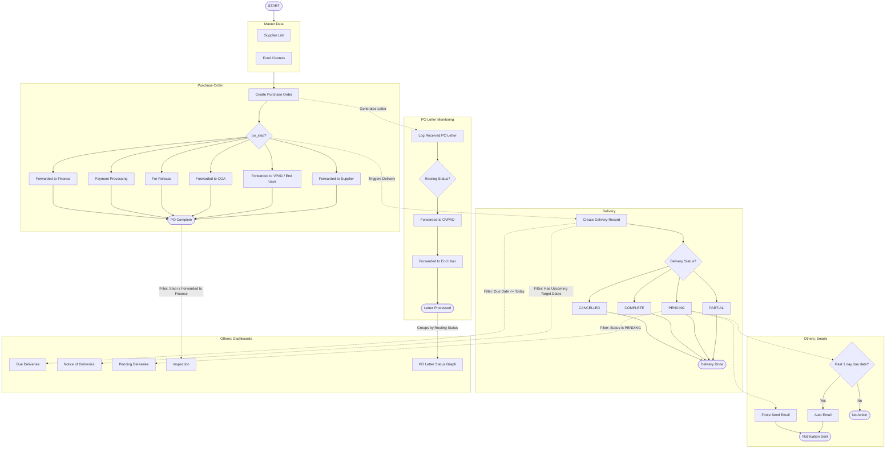
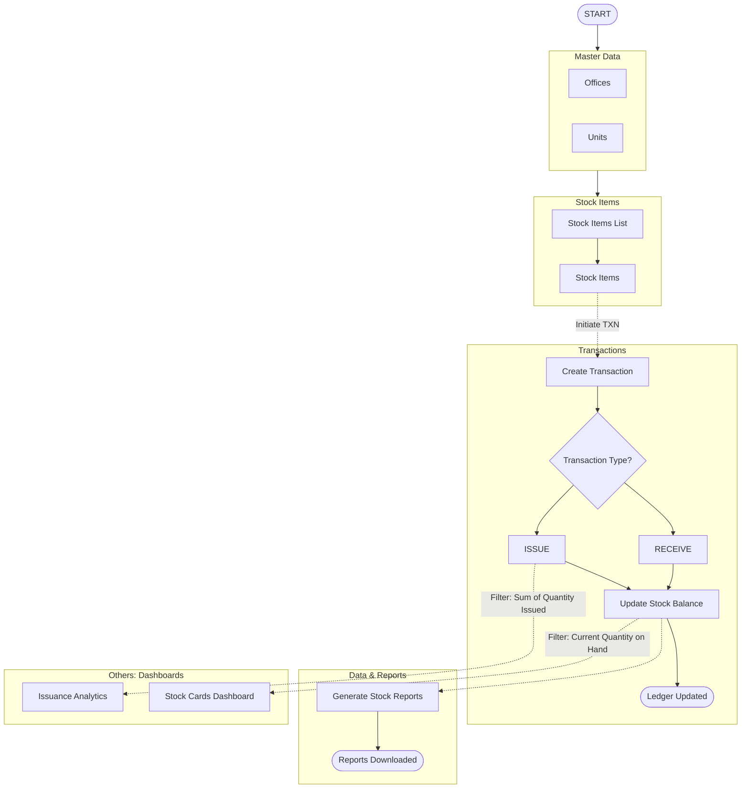
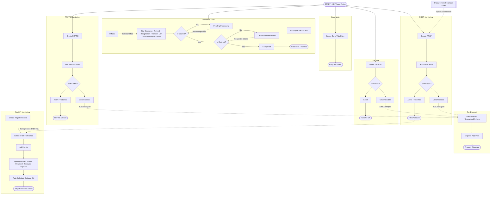

# SMIS System Process Flowcharts

These flowcharts document the **actual system process logic**, categorized by system modules exactly as they flow in the database, breaking down sub-decisions, status transitions, auto-email routing, and dashboard analytics transfers. 

---

## Diagram 1: PROCUREMENT & DELIVERIES

---

## Diagram 2: STOCK CARDS

---

## Diagram 3: ASSETS & PERSONNEL FILES

